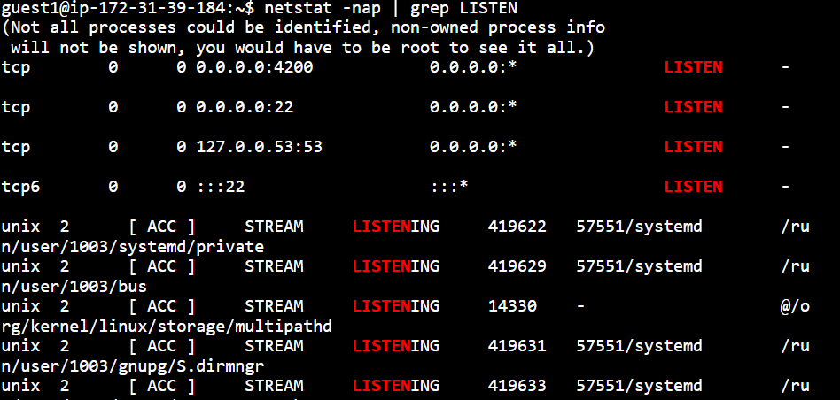

# netstat

<aside>
💡 author : 김가은(circleolami) 2023-09-26

</aside>

현재 네트워크의 연결 상태, 라우팅 테이블, 인터페이스 상태를 확인할 때 사용하는 리눅스 명령어입니다. 

```bash
netstat [option]
```

- 옵션
    
    
    | 옵션 | 설명 |
    | --- | --- |
    | -a | 모든 네트워크 상태 출력 [-all] |
    | -c | 현재 실행 명령을 매 초마다 실행 [-continuous] |
    | -e | 확장된 정보 출력 [-extend] |
    | -g | 멀티캐스트에 대한 그룹별 정보 출력 [-groups] |
    | -i | 인터페이스별 통계값 출력 [-interface] |
    | -l | 대기중인 네트워크 [-listening] |
    | -n | 도메인 주소를 숫자로 출력 [-numeric] |
    | -o | 연결 대기 시간 출력 [-timers] |
    | -p | PID와 사용중인 프로그램명 출력 [-program] |
    | -r | 라우팅 테이블 출력 [-route] |
    | -s | 프로토콜 요약 정보 출력 [-statistics] |
    | -t | TCP 프로토콜 출력 [-tcp] |
    | -u | UDP 프로토콜 출력 [-udp] |
    | -v | 버전 출력 [-version] |
    | -w | RAW 프로토콜 출력 [-raw] |
    | -A | 프로토콜별로 출력 [-protocol] |
    | -M | 마스커레이딩 정보 출력 [-masquerade] |
- 사용 예
    - 모든 네트워크 연결 확인
        
        ```bash
        netstat -a 
        ```
        
        
        
    - LISTEN 상태인 포트만 출력
        
        ```bash
        netstat -nap | grep LISTEN
        ```
        
        
        
        계속