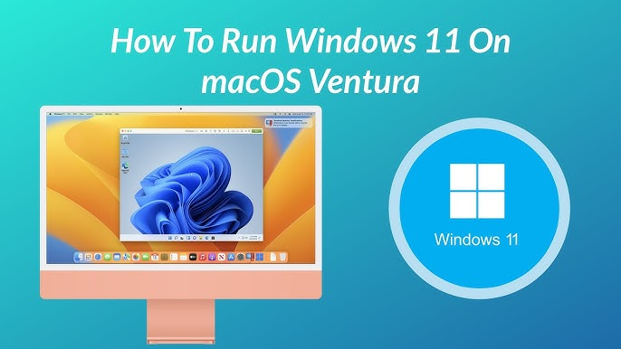

# 가상화 기술, 가상환경, 가상머신

<aside>
👨🏻‍💻 author : 전재호(agamtt) 2023-11-24

</aside>

<aside>
💡 가상환경이 뭔가요?

</aside>

가상화 기술이란 컴퓨터 안에 프로그램으로 또다른 컴퓨터를 작동시키는 기술을 말합니다. 

# 가상머신(Virtual Machine)

예를 들어, MacOS 에 설치할 수 있는 UTM (Universal Turing Machine) 은 MacOS 안에서 Windows 등 다른 OS 를 설치할 수 있게 합니다. 그래서 맥북으로 Windows용 프로그램을 실행할 때 주로 사용됩니다.

이렇게, 실제로 존재하는 컴퓨터는 아니지만, 가상화 기술을 통해 생성된 컴퓨터를 **가상머신(Virtual Machine)** 이라고 부릅니다.

완전히 반대의 경우도 가능합니다. Windows 안에 MacOS 를 실행할 수도 있습니다.

Qemu, Virtual Box, VMware Workstation, VMware Fusion 등 프로그램을 통해 가상환경을 만들 수 있습니다. 이런 프로그램들은 가상머신을 만들고, 그 가상머신과 실제 존재하는 모니터, 키보드, 마우스 등을 자동으로 연결해줍니다.

그 중에서 가장 세팅하기 쉬운 docker 를 사용하도록 하겠습니다.

docker 를 사용하면 여러개의 가상환경을 생성하고 삭제하는 것이 다른 프로그램들에 비해 훨씬 쉽습니다. 

# 게스트(Guest), 호스트(Host)

가상머신(Virtual Machine) 을 생성했을때, 가상머신 안에서 작동하는 OS 를 손님이라는 의미에서 Guest OS 라고 부릅니다.  가상머신을 작동시키는 OS, 그러니까 먼저 설치된 OS 를 주인이라는 의미에서 호스트(Host) 라고 부릅니다.

예를 들어, MacOS 안에 Windows 를 설치하면, 

Host OS = MacOS

Guest OS = Windows

가 되는 것 입니다.

