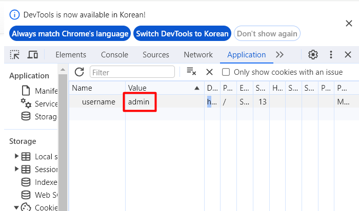

# 풀어봅시다 : DreamHack : Cookie

<aside>
💡 author : 김가은(circleolami) 2023-01-25

</aside>

지금까지 배운 개념을 이용한 문제를 풀어봅시다

## 해킹대회

실제 사이트에 해킹을 해보는 것은 현행법상 불법입니다.


그러나 정보 보안을 공부하는 사람을 위해 (블랙햇들도 출전하지만) 해킹기술을 연습할 수 있도록 문제풀이 형식의 해킹 대회라는 것이 존재합니다.

# CTF (Capture The Flag)

CTF 는 해킹 대회의 형식 중 가장 널리 쓰이는 방식입니다.

CTF 는 Capture The Flag (깃발 뺏기)의 약자인데, 

여기서 깃발(Flag)은 문제에 숨겨진 랜덤문자열을 말합니다.

문제 출제자는 이 Flag를 보안 시스템 안에 숨겨놓습니다.

해커는 보안 시스템을 해킹해서, 이 깃발을 얻어내는 것이 목표입니다.

한번, 실제 CTF 문제를 풀어보면서, 해킹 대회에 대해 배워봅시다.

우리가 배운 Cookie 는 해킹 대회의 단골 주제 중 하나 입니다.

(역사상 Cookie 해킹이 많이 이루어졌기 때문입니다. 해킹 대회는 실제 해킹 사례를 반영하거든요)

## 드림핵 가입

우선 드림핵에 가입합니다. 


## 워게임

드림핵 홈페이지에서 워게임을 클릭합니다. 


“초보자를 위한 입문용 문제” 를 클릭합니다.


입문용 문제에서 cookie를 클릭합니다. cookie 이외에도 여러 문제를 풀 수 있습니다. 


## Cookie

이 문제는 쿠키로 인증 상태를 관리하는 로그인 서비스입니다.


이 곳에 Flag 를 제출하면, 해킹을 성공한 것으로 간주됩니다.

서버 생성하기를 누르면, 접속할 수 있는 임시서버가 생성됩니다. 


접속 링크로 들어가면 다음과 같은 화면을 만날 수 있습니다. 

이건 우리가 고양이 홈페이지를 만들었던 것 처럼, 문제 출제자가 설계한 보안 시스템입니다.

이 곳 어딘가에, Flag(깃발)이 숨겨져있고, 그것을 찾아내는 것이 목표입니다.


# 문제 파일 확인하기

우리가 어떤 시스템을 해킹할 때, 그 시스템은 보통 코딩으로 만들어져있을 것 입니다.

보통 코드는 개발자만 알고 있고, 사용하는 유저는 알 수 없습니다.

그러나 코드를 모르는 상태에서 해킹을 하는 것은 너무 어려우므로, 쉬운 해킹 대회 문제에서는 시스템의 코드를 줍니다. (안주는 문제도 있습니다)


문제 파일을 확인해봅시다. 

# 코드 분석하기

이것은 flask 라는 것으로 만든 웹페이지 입니다.

문법은 다르지만, 웹은 핵심 기능은 뭘로 만들건 다 비슷합니다.

```python
#!/usr/bin/python3
from flask import Flask, request, render_template, make_response, redirect, url_for

app = Flask(__name__)

try:
    FLAG = open('./flag.txt', 'r').read()
except:
    FLAG = '[**FLAG**]'

users = {
    'guest': 'guest',
    'admin': FLAG
}

@app.route('/')
def index():
    username = request.cookies.get('username', None)
    if username:
        return render_template('index.html', text=f'Hello {username}, {"flag is " + FLAG if username == "admin" else "you are not admin"}')
    return render_template('index.html')

@app.route('/login', methods=['GET', 'POST'])
def login():
    if request.method == 'GET':
        return render_template('login.html')
    elif request.method == 'POST':
        username = request.form.get('username')
        password = request.form.get('password')
        try:
            pw = users[username]
        except:
            return '<script>alert("not found user");history.go(-1);</script>'
        if pw == password:
            resp = make_response(redirect(url_for('index')) )
            resp.set_cookie('username', username)
            return resp 
        return '<script>alert("wrong password");history.go(-1);</script>'

app.run(host='0.0.0.0', port=8000)
```

# 문제가 요구하는 FLAG 가 어느 것인지 찾기

이 코드는 서버에서 작동하는 백앤드 코드입니다.

이 부분을 보면, 파이썬의 open() 함수로 로컬에 있는 파일을 읽습니다. 이것은 서버에 저장되어있습니다.

./flag.txt 가 우리가 원하는 flag 인 것으로 보입니다.

서버에 저장되어있으므로 해커인 우리는 읽을 방법이 없습니다만,

이 읽혀진 문자열이 FLAG 라는 변수에 저장되므로, 이 FLAG 값을 유출해서 간접적으로 flag 를 얻을 수 있을 것으로 보입니다.

```python
try:
    FLAG = open('./flag.txt', 'r').read()
except:
    FLAG = '[**FLAG**]'
```

고양이 홈페이지와 마찬가지로, pw 와 password 가 같은지 검사하는 코드가 있습니다. 로그인 시스템인 것이죠.

이때, password 는 코드를 살펴보면, request.form 즉 사용자가 폼에 입력한 패스워드입니다.

```python
password = request.form.get('password')
...중략...
        if pw == password:
            resp = make_response(redirect(url_for('index')) )
            resp.set_cookie('username', username)
            return resp 
```

로그인 정보를 보면, guest의 패스워드는 guest이고

admin의 패스워드는 FLAG임을 알 수 있습니다.

admin의 패스워드는 FLAG 이므로 우리가 알 수 있는 값이 아닙니다. 따라서 admin의 비밀번호를 입력해서 정상적인 방법으로 로그인하는 것은 불가능해보입니다.

render_template 는 화면에 파이썬 변수를 html 로 출력하는 함수입니다.

아래를 보면, admin 으로 로그인에 성공하면 웹사이트가 FLAG 를 출력해줍니다.

이것을 보고, 해킹공격을 통해 admin으로 로그인하는 것이 문제의도임을 추측할 수 있습니다.

```python
@app.route('/')
def index():
    username = request.cookies.get('username', None)
    if username:
        return render_template('index.html', text=f'Hello {username}, {"flag is " + FLAG if username == "admin" else "you are not admin"}')
    return render_template('index.html')
```

guest로 로그인을 하면 admin이 아니라는 문구가 뜹니다. 


cookie 정보를 확인해 봅시다. 

cookie 정보는 마우스 우클릭 > 검사 > Application > Cookies으로 확인할 수 있습니다. 


# Cookie Poisoning Attack

로그인 시스템의 취약점은 여기에서 발생합니다.

```python
@app.route('/')
def index():
    username = request.cookies.get('username', None)
    if username:
        return render_template('index.html', text=f'Hello {username}, {"flag is " + FLAG if username == "admin" else "you are not admin"}')
    return render_template('index.html')
```

username 이 admin 이기만 하면 flag is FLAG 로 우리가 원하는 플래그를 얻을 수 있습니다.

```python
{"flag is " + FLAG if username == "admin" else "you are not admin"}')
```

여기서 username 은 쿠키이므로, 클라이언트-사이드에서 얼마든지 변조할 수 있습니다. (Client-side Cookie Poisoning)

username이 guest입니다. guest를 admin으로 바꿔봅시다. 



새로고침을 하면 flag를 얻을 수 있습니다. 


이것을 복사해서, 

이곳에 붙여넣고 제출하기를 누르면 됩니다.


그러면 해킹에 성공합니다.

계속